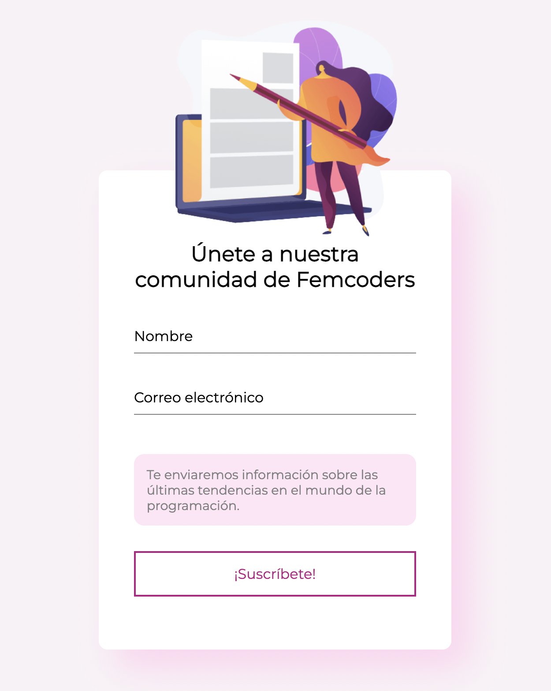

# Formulario de Suscripción Animado para Femcoders 

## Comenzando 🚀

Problema a resolver: La compañía Femcoders acaba de crear un blog sobre programación y tendencias digitales, ellos están buscando suscriptoras.
Para resolver su problema me planteé como objetivo: Hacer un formulario de suscripción que permita a su audiencia suscribirse fácilmente..


### Pre-requisitos 📋

Disponer de un navegador con javascript habilitado.

### Instalación 🔧

```
Basta con descargar el .zip con el proyecto y abrir animacion2.html
```
Así se tiene que ver:



## Forma de trabajar

Organización: A través de un tablero Kanban en Trello. 


## Usabilidad: (Nielsen)

* Mantener al usuario informado: Sí, le muestro lo que está sucediendo a medida que llena el formulario.
* Coincidencia entre el sistema y el mundo real: El formulario se dirige a una audiencia determinada y se usa un argot conocido por la misma.
* Control y libertad por parte del usuario: El usuario puede decidir no enviar el formulario.
* Consistencias y estándares: Colores para campos válidos e inválidos. Tanto en los mensajes de error, como en las líneas.
* Reconocer, diagnosticar y recuperarse de los errores: Mensajes para saber cuál es el problema y que hay que hacer.

## Principios SOLID:

* Principio de responsabilidad única: Trate de hacer funciones con la menor responsabilidad posible.
* Principio de abierto y cerrado: Debemos ser capaces de entender el comportamiento de una función sin modificarla.
* Principio de segregación: Utilice todas las funciones de mi código.

## Ejecutando las pruebas ⚙️

## Construido con 🛠️

* Javascrip
* Css
* Html5
## Autora ✒️

* **Cristina Sanjuán** 
